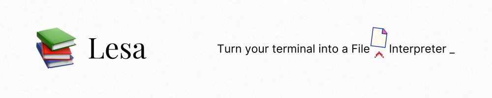

> _lesa_ (verb) - to read, to study, to learn

**_lesa_** is a CLI tool built in Python that allows you to converse with your documents from the terminal, completely offline and on-device using **Ollama**. Open the terminal in the directory of your choice and start a conversation with any document!

<div align="center">

[](https://www.python.org/downloads/)
[](https://badge.fury.io/py/lesa)


</div>

## Setup

### Prerequisites

This project uses [Ollama](https://ollama.com/) under the hood to utilize the power of large language models. To install Ollama, run:

```bash
curl -fsSL https://ollama.com/install.sh | sh
```

We recommend the Llama 3.1 8b or Qwen 4b model for the same. You can use any other model as well, just make sure it has enough context window to understand the content of your documents.

Pull Llama or Qwen using:

```bash
ollama pull qwen:4b
```

or

```bash
ollama pull llama3.1
```

### Installation

Simply install the package using pip:

```bash
pip install lesa
```
