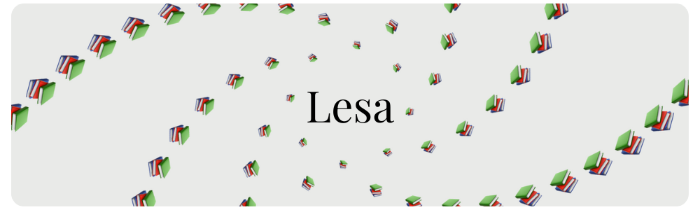

<div align="center">

[](https://www.python.org/downloads/)


</div>

<div align="center">

**_lesa_**
`[lee - saa]` • **Old Norse** <br/>
(v.) to read, to study, to learn

<!-- <div align="center">
  <sub>Prepared by <a href="https://github.com/shxntanu">Shantanu Wable</a> and <a href="https://github.com/omkargwagholikar">Omkar Wagholikar</a> </sub>
</div> -->

</div>

`lesa` is a CLI tool built in Python that allows you to converse with your documents from the terminal, completely offline and on-device using **Ollama**. Open the terminal in the directory of your choice and start a conversation with any document!


## Usage

To start a conversation with a document (`.pdf` and `.docx` for now), simply run:

```bash
lesa read path/to/your/document
```

Or start a conversation with an already-embedded directory, run:

```bash
lesa chat
```

### Embed

To embed all files from your current working directory, run:

```bash
lesa embed
```

This creates a `.lesa` config folder in your current working directory that stores the embeddings of all the documents in the directory.

<!-- ## Features

-   🖥️ **Completely On-Device**: Uses Ollama under the hood to interface with LLMs, so you can be sure your data is not leaving your device.
-   📚 **Converse with (almost) all documents**: Supports PDF, DOCX and Text files.
-   🤖 **Wide Range of LLMs**: Choose the Large Language Model of your choice. Whether you want to keep it quick and concise, or want to go all in with a huge context window, the choice is yours. -->

## Setup

### Prerequisites

`lesa` uses [Ollama](https://ollama.com/) under the hood to utilize the power of large language models. To install Ollama, run:

```bash
curl -fsSL https://ollama.com/install.sh | sh
```

`lesa` uses the Llama 3.1 8b as the default. You can use any other model as well, just make sure it has enough context window to understand the content of your documents.

Pull Llama using:

```bash
ollama pull llama3.1
```

### Installation

Simply install the package using pip:

```bash
pip install lesa
```

To upgrade to the latest version, run:

```bash
pip install -U lesa
```

## Contribute

We welcome contributions! If you'd like to improve `lesa` or have any feedback, feel free to open an issue or submit a pull request.

## License

Apache-2.0
